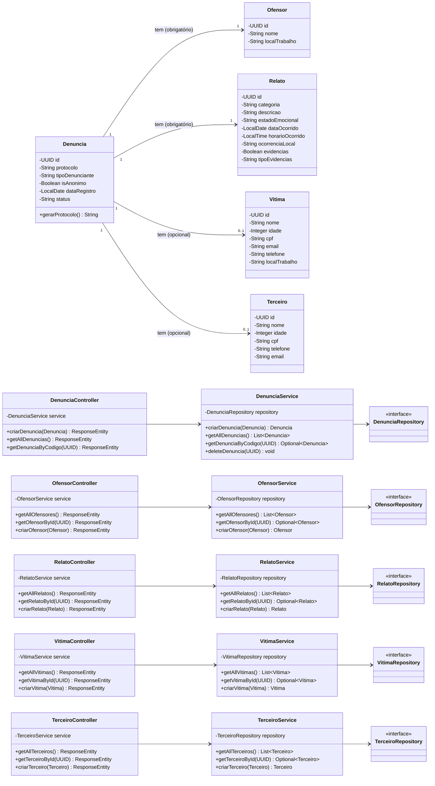
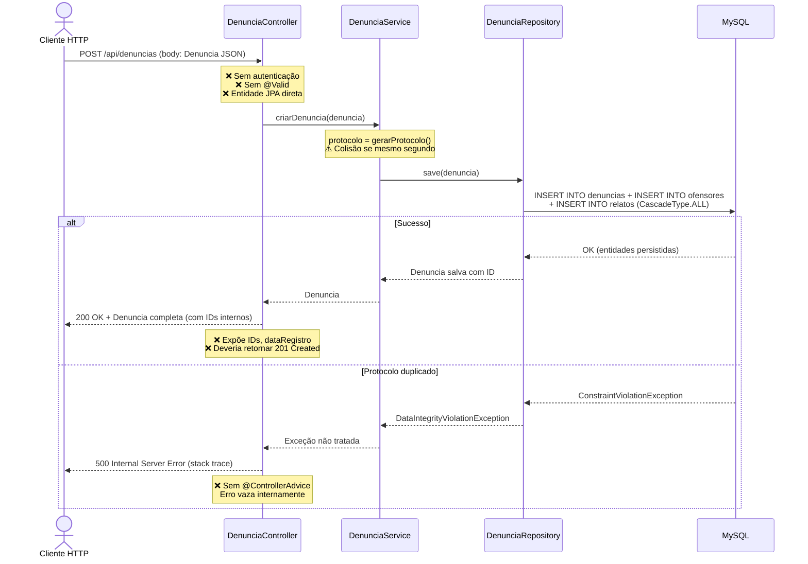
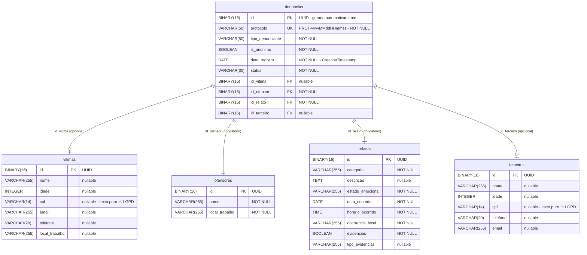

# 🔍 Análise Técnica Completa — Backend `CanalDenuncia_Back`
**Projeto:** CISBAF — Canal de Denúncias de Assédio  
**Stack:** Java 21 · Spring Boot 4.0.6 · Spring Data JPA · MySQL 8.0 · Lombok · Docker  
**Revisão por:** Engenheiro de Software Sênior / Arquiteto de Soluções

---

## 1. Visão Geral da Arquitetura

O projeto implementa uma **API REST** para registro e consulta de denúncias de assédio. A estrutura de pacotes segue o padrão **MVC em camadas**:

```
controller/   → Camada HTTP (entrada/saída)
service/      → Regras de negócio
repository/   → Acesso a dados (Spring Data JPA)
model/        → Entidades JPA
dto/          → Objetos de transferência de dados
```

A organização é coerente e bem-conhecida no ecossistema Spring, porém apresenta falhas estruturais significativas que comprometem segurança, manutenibilidade e escalabilidade.

---

## 2. Qualidade do Código e Boas Práticas

### ✅ Pontos Positivos

| Item | Observação |
|---|---|
| Uso de Lombok (`@RequiredArgsConstructor`, `@Data`) | Reduz boilerplate de forma adequada |
| Injeção por construtor | Correto — evita field injection com `@Autowired` |
| Records como DTOs | Uso moderno e imutável do Java 16+ |
| `@CreationTimestamp` | Boa prática para auditoria automática |
| UUID como PK | Correto para dados sensíveis — evita enumeração de IDs |
| Healthcheck no Docker | Boa prática de orquestração |
| `env_file` no docker-compose | Credenciais fora do código-fonte |

---

### 🔴 Anti-patterns e Violações Críticas

#### 2.1 — DTOs criados mas **completamente ignorados** (violação grave de DRY + SRP)

O pacote `dto/` contém cinco classes (`DenunciaDto`, `OfesorDto`, `RelatoDto`, `TerceiroDto`, `VitimaDto`), mas **nenhum controller ou service as utiliza**. Os endpoints recebem e retornam as **entidades JPA diretamente**:

```java
// DenunciaController.java — PROBLEMA
@PostMapping
public ResponseEntity<Denuncia> criarDenuncia(@RequestBody Denuncia denuncia) { ... }
//                                                            ^^^^^^^^
//                           Entidade JPA exposta diretamente na API — nunca use o DTO!
```

**Consequências:**
- Exposição de campos internos do banco de dados ao cliente HTTP.
- Acoplamento total entre a camada de persistência e a camada de apresentação.
- Qualquer mudança no modelo JPA quebra o contrato da API.
- Falha de segurança: o cliente pode enviar qualquer campo da entidade, incluindo `id`, `protocolo`, e `dataRegistro`.

> [!CAUTION]
> Expor entidades JPA diretamente em endpoints REST é um dos anti-patterns mais perigosos em APIs Spring. Permite **mass assignment attacks** e vaza metadados internos do banco.

---

#### 2.2 — Método `deleteDenuncia` com `TODO` em produção

```java
// DenunciaService.java
public void deleteDenuncia(UUID id) {
    // TODO Auto-generated method stub
    throw new UnsupportedOperationException("Unimplemented method 'deleteDenuncia'");
}
```

Um método não implementado que lança exceção existe no código e **não possui endpoint** correspondente. É código morto/ruído que pode causar falha se chamado acidentalmente.

---

#### 2.3 — Geração de protocolo com lógica fraca e problema de concorrência

```java
// Denuncia.java
private String protocolo = gerarProtocolo();

private String gerarProtocolo() {
    return "PROT-" + LocalDateTime.now().format(DateTimeFormatter.ofPattern("yyyyMMddHHmmss"));
}
```

**Problemas:**
1. **Colisão garantida sob carga:** resolução de segundos significa que duas denúncias criadas no mesmo segundo terão o mesmo protocolo — a constraint `unique = true` lançará exceção não tratada.
2. **Lógica de negócio na entidade JPA:** viola o princípio SRP. A entidade não deve conter lógica de geração de dados.
3. O campo é inicializado no construtor implícito do Lombok, mas o método privado sem visibilidade adequada gera acoplamento interno.

**Correção recomendada:**
```java
// No Service, antes de salvar:
denuncia.setProtocolo("PROT-" + UUID.randomUUID().toString().substring(0, 8).toUpperCase());
```

---

#### 2.4 — `@CrossOrigin(origins = "*")` em todos os controllers

```java
@CrossOrigin(origins = "*")  // PROBLEMA — aplicado em TODOS os controllers
```

Permite requisições de **qualquer origem** para qualquer endpoint da API. Em um sistema de denúncias sensíveis, isso é inadmissível.

**Correção:** configurar CORS globalmente via `WebMvcConfigurer` restringindo às origens conhecidas:

```java
@Configuration
public class CorsConfig implements WebMvcConfigurer {
    @Override
    public void addCorsMappings(CorsRegistry registry) {
        registry.addMapping("/api/**")
                .allowedOrigins("https://seu-dominio-producao.com.br")
                .allowedMethods("GET", "POST", "PUT", "DELETE");
    }
}
```

---

#### 2.5 — Nenhuma validação de entrada (`@Valid` ausente)

Os controllers aceitam dados sem qualquer validação:

```java
// Nenhum @Valid nos RequestBody
public ResponseEntity<Denuncia> criarDenuncia(@RequestBody Denuncia denuncia) { ... }
```

Embora a dependência `spring-boot-starter-validation` esteja no `pom.xml`, ela **não é utilizada em nenhum lugar**. Campos como `nome`, `cpf`, `email` chegam sem validação alguma.

---

#### 2.6 — Tipagem por `String` para campos de domínio rico (Primitive Obsession)

```java
// Denuncia.java
private String tipoDenunciante; // "VITIMA", "TERCEIRO" ou "ANONIMO"? Sem contrato.
private String status;          // "Pendente", "Em investigação" ou "Resolvida"?

// Relato.java
private String categoria;       // Quais categorias são válidas?
private String estadoEmocional; // Campo aberto sem restrição
```

Nenhum desses campos usa `enum`, o que significa que qualquer string é aceita, inclusive valores inválidos. Isso viola o princípio de **Design by Contract** e abre brechas para dados inconsistentes no banco.

---

#### 2.7 — `@Data` em entidades JPA (Anti-pattern conhecido)

`@Data` do Lombok gera `equals()`, `hashCode()` e `toString()` baseados em todos os campos. Em entidades JPA, isso causa:
- **Loops infinitos** no `toString()` se houver relacionamentos bidirecionais.
- **Falhas no hashCode** com lazy loading (entidade não carregada).
- Performance degradada com `@OneToOne` cascadeados.

**Recomendação:** substituir por `@Getter @Setter` e implementar `equals/hashCode` baseados apenas no `id`.

---

#### 2.8 — `OfesorDto.java` — Erro tipográfico no nome do arquivo

O arquivo se chama `OfesorDto.java` (um 's'), mas a entidade é `Ofensor.java` (dois 's'). Inconsistência de nomenclatura que confunde o time.

---

#### 2.9 — `@Column(nullable = true)` explícito desnecessário

```java
// nullable = true é o valor padrão — código ruído
@Column(nullable = true)
private String nome;
```

Repete o comportamento padrão em múltiplas entidades. Remova para reduzir ruído.

---

#### 2.10 — `Vitima.java` sem `@Table`

```java
@Entity
@Data
public class Vitima { ... }  // Sem @Table(name = "vitimas")
```

O nome da tabela será gerado pelo Hibernate com a convenção padrão (`vitima`), diferentemente das outras entidades que declaram explicitamente. Inconsistência arquitetural.

---

#### 2.11 — `findByStatus` retorna `Optional<List<Denuncia>>`

```java
// DenunciaRepository.java
Optional<List<Denuncia>> findByStatus(String status);
```

`Optional<List>` é um anti-pattern: uma lista vazia `[]` já expressa ausência de resultados. `Optional` aqui é desnecessário e semanticamente incorreto. O correto é `List<Denuncia>`.

---

#### 2.12 — `spring.jpa.show-sql=true` no `application.properties` base

Exibe todas as queries SQL no log em **qualquer ambiente**, incluindo produção. Dados sensíveis de denúncias podem vazar nos logs do servidor.

---

## 3. Arquitetura e Design Patterns

### Padrões Identificados

| Padrão | Status | Observação |
|---|---|---|
| **MVC em camadas** | ✅ Presente | Separação Controller → Service → Repository |
| **Repository Pattern** | ✅ Presente | Via Spring Data JPA |
| **DTO Pattern** | ⚠️ Declarado, nunca usado | DTOs existem mas são ignorados |
| **Dependency Injection** | ✅ Presente | Via construtor + Lombok |
| **Builder Pattern** | ⚠️ Declarado, nunca usado | `@Builder` nos records sem uso |

### 🔴 Ausências Arquiteturais Críticas

| Ausência | Impacto |
|---|---|
| **Sem camada de segurança (Spring Security + JWT)** | API completamente aberta — qualquer pessoa pode criar/listar denúncias |
| **Sem tratamento de exceções global (`@ControllerAdvice`)** | Erros lançam stack traces ao cliente HTTP |
| **Sem paginação nos endpoints de listagem** | `findAll()` em produção retornará a tabela inteira — risco de OutOfMemoryError |
| **Sem logging estruturado (SLF4J/Logback)** | Sem rastreabilidade de operações |
| **Sem camada de mapper (ModelMapper/MapStruct)** | Impede uso efetivo dos DTOs |
| **Sem tratamento transacional (`@Transactional`)** | Operações compostas podem gerar estados inconsistentes |
| **Sem testes** | A pasta `test/` existe mas está vazia |
| **Sem versionamento de API (`/api/v1/`)** | Impossível evoluir a API sem quebrar clientes |

---

## 4. Segurança e Performance

### 🔴 Vulnerabilidades de Segurança

#### S1 — API completamente não autenticada

Não há Spring Security configurado. Qualquer requisição HTTP para `/api/denuncias` retorna **todas as denúncias**, incluindo dados de vítimas, CPFs e relatos de assédio. Este é o maior risco do sistema.

#### S2 — Mass Assignment via entidade JPA

```java
// Um atacante pode enviar um JSON forjado:
{
  "id": "uuid-escolhido-pelo-atacante",
  "protocolo": "PROT-CUSTOM",
  "status": "Resolvida",
  "dataRegistro": "2020-01-01",
  "vitima": { "cpf": "...", "email": "..." }
}
```

Como o `@RequestBody` mapeia direto para a entidade, todos esses campos são gravados no banco sem restrição.

#### S3 — Exposição de CPF em texto plano

Os campos `cpf` em `Vitima` e `Terceiro` são armazenados como `String` sem nenhuma criptografia, hashing ou mascaramento. CPF é dado sensível sob a LGPD.

#### S4 — Healthcheck com credencial em texto claro no docker-compose

```yaml
test: ["CMD", "mysqladmin", "ping", "-h", "localhost", "-u", "root", "-proot"]
#                                                                        ^^^^^^
#                                                             Senha hardcoded no YAML
```

A senha `root` está hardcoded no `docker-compose.yml`. Qualquer pessoa com acesso ao repositório tem a senha do banco.

#### S5 — `MYSQL_ROOT_HOST=%` no docker-compose

```yaml
environment:
  - MYSQL_ROOT_HOST=%
```

Permite conexões root de **qualquer host**. Em rede Docker isso é menos crítico, mas se a porta 3306 estiver exposta externamente (e está: `"3306:3306"`), o banco fica acessível para toda a internet.

#### S6 — Porta 3306 exposta externamente

```yaml
mysql:
  ports:
    - "3306:3306"  # Banco acessível externamente
```

Em produção, o banco de dados jamais deve ter porta exposta ao host externo — apenas os serviços internos da rede Docker devem acessá-lo.

### ⚠️ Gargalos de Performance

#### P1 — `findAll()` sem paginação

```java
// Retorna TODAS as denúncias do banco
public List<Denuncia> getAllDenuncias() {
    return denunciaRepository.findAll();
}
```

Com 10.000 denúncias no banco e relacionamentos `OneToOne` com CascadeType.ALL, cada chamada carrega um enorme grafo de objetos em memória.

**Correção:** usar `Pageable`:
```java
Page<Denuncia> findAll(Pageable pageable);
```

#### P2 — N+1 Problem potencial com `@OneToOne`

Quatro relacionamentos `@OneToOne` sem `fetch = FetchType.LAZY`. O Hibernate faz join automático em todos os relacionamentos a cada query, mesmo quando não necessários.

#### P3 — `ddl-auto=update` em todos os ambientes

```properties
spring.jpa.hibernate.ddl-auto=update
```

O `update` executa ALTER TABLE automaticamente ao iniciar a aplicação. Em produção, isso é perigoso e pode causar downtime ou perda de dados. Use migrations com **Flyway** ou **Liquibase**.

#### P4 — `spring-boot-devtools` ativo em runtime

DevTools com `restart.enabled=true` está configurado para rodar dentro do container Docker em produção — overhead desnecessário de ClassLoader polling.

---

## 5. Diagramas UML

### 5.1 Diagrama de Classes



---

### 5.2 Diagrama de Sequência — Fluxo de Criação de Denúncia



---

### 5.3 Diagrama Entidade-Relacionamento (ERD)



---

## 6. Roadmap de Melhorias Prioritárias

### 🔴 Prioridade Crítica (Segurança)

| # | Ação | Arquivo(s) |
|---|---|---|
| 1 | Adicionar Spring Security + JWT | Nova config `SecurityConfig.java` |
| 2 | Usar DTOs nos controllers (não a entidade JPA) | Todos os controllers + mappers |
| 3 | Criptografar CPF no banco (AES/BCrypt) | `Vitima.java`, `Terceiro.java` |
| 4 | Remover porta 3306 exposta externamente | `docker-compose.yml` |
| 5 | Corrigir healthcheck (sem senha hardcoded) | `docker-compose.yml` |
| 6 | Restringir CORS para domínios conhecidos | Nova `CorsConfig.java` |

### 🟡 Prioridade Alta (Qualidade)

| # | Ação | Arquivo(s) |
|---|---|---|
| 7 | Adicionar `@Valid` + anotações de validação nos DTOs | DTOs + controllers |
| 8 | Criar `@ControllerAdvice` global para tratamento de erros | Nova `GlobalExceptionHandler.java` |
| 9 | Converter `status` e `tipoDenunciante` para `enum` | `Denuncia.java` + `DenunciaService.java` |
| 10 | Corrigir geração de protocolo (sem colisão) | `DenunciaService.java` |
| 11 | Adicionar paginação nos `findAll()` | Services + controllers |
| 12 | Substituir `@Data` por `@Getter @Setter` nas entidades | Todos os models |

### 🟢 Prioridade Média (Manutenibilidade)

| # | Ação | Arquivo(s) |
|---|---|---|
| 13 | Adicionar Flyway para versionamento de schema | `pom.xml` + migration SQLs |
| 14 | Renomear `OfesorDto` para `OfensorDto` | `OfesorDto.java` |
| 15 | Adicionar `@Table` em `Vitima` | `Vitima.java` |
| 16 | Desabilitar `show-sql` em produção | `application-prod.properties` |
| 17 | Adicionar testes unitários e de integração | `src/test/` |
| 18 | Versionamento da API (`/api/v1/`) | Todos os controllers |
| 19 | Adicionar logging com SLF4J/MDC | Services |
| 20 | Remover `deleteDenuncia` não implementado ou implementá-lo | `DenunciaService.java` |

---

## 7. Scorecard Final

| Dimensão | Nota | Justificativa |
|---|---|---|
| **Qualidade do Código** | 5/10 | Estrutura clara, mas anti-patterns críticos (entidade como DTO) |
| **Princípios SOLID** | 4/10 | SRP violado na entidade, DTOs ignorados |
| **Arquitetura** | 5/10 | MVC bem estruturado, mas sem segurança, sem paginação, sem mapper |
| **Segurança** | 2/10 | API aberta, CPF em plain text, CORS wildcard, porta BD exposta |
| **Performance** | 4/10 | findAll() sem paginação, N+1 latente, devtools em runtime |
| **Manutenibilidade** | 5/10 | Sem testes, sem migrations, sem tratamento de erro global |
| **Conformidade LGPD** | 2/10 | CPF em texto claro, sem controle de acesso a dados sensíveis |

> [!IMPORTANT]
> O sistema lida com dados extremamente sensíveis (vítimas de assédio, CPFs, relatos). A ausência total de autenticação/autorização e a exposição de dados sem filtragem via DTOs tornam a implantação em produção, no estado atual, **inviável do ponto de vista de segurança e conformidade legal (LGPD)**.
