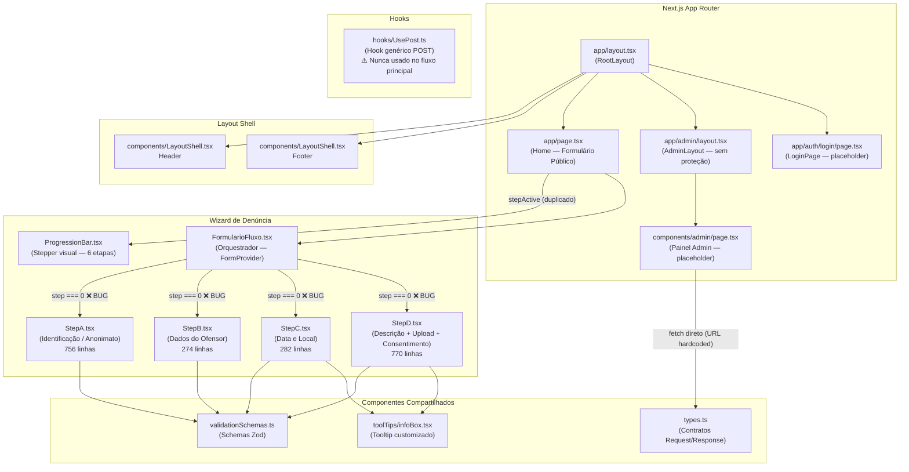
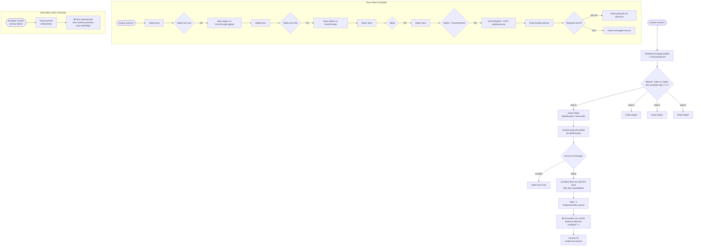

# 🔍 Análise Técnica Completa — Frontend `CanalDenuncia_Front`
**Projeto:** CISBAF — Canal de Denúncias de Assédio  
**Stack:** Next.js 16 · React 19 · TypeScript 5 · MUI v9 · React Hook Form · Zod · Tailwind CSS  
**Revisão por:** Engenheiro Frontend Sênior

---

## 1. Visão Geral da Arquitetura

O frontend é uma **SPA/MPA híbrida** construída com o App Router do Next.js. Implementa um formulário multi-step (wizard) para registro de denúncias, com uma área administrativa em desenvolvimento e uma rota de autenticação vazia.

```
app/
├── page.tsx          → Rota principal (formulário público)
├── layout.tsx        → Layout raiz (Header + Footer)
├── admin/            → Área admin (sem proteção de rota)
└── auth/login/       → Login (placeholder vazio)

components/
├── LayoutShell.tsx   → Header + Footer
├── types.ts          → Contratos de tipo com a API
├── base/             → Componentes do formulário público
│   ├── FormularioFluxo.tsx   → Orquestrador do wizard
│   ├── ProgressionBar.tsx    → Stepper visual
│   ├── StepA–D.tsx           → Etapas do formulário
│   └── validationSchemas.ts  → Schemas Zod
└── toolTips/infoBox.tsx      → Componente de tooltip

hooks/
└── UsePost.ts        → Hook genérico de POST
```

---

## 2. Arquitetura de Componentes

### ✅ Pontos Positivos

| Item | Observação |
|---|---|
| React Hook Form + Zod | Combinação moderna e performática para formulários |
| Schemas de validação centralizados | `validationSchemas.ts` bem organizado |
| `FormProvider` com contexto compartilhado | Boa intenção arquitetural |
| `types.ts` separado | Contratos de Request/Response com a API bem definidos |
| Hook customizado `usePost` | Encapsulamento reutilizável de fetch |
| `InfoBox` reutilizável | Componente de tooltip bem abstraído |
| Validação condicional por Zod (`getStepASchema`) | Lógica dinâmica elegante |

---

### 🔴 Bug Crítico #1 — Todos os Steps renderizam simultaneamente

Este é o defeito mais grave do sistema. Em `FormularioFluxo.tsx`:

```tsx
// FormularioFluxo.tsx — TODOS os steps têm a condição step === 0
{step === 0 && <StepA onAvançar={proximaEtapa} onVoltar={etapaAnterior} />}
{step === 0 && <StepB onAvançar={proximaEtapa} onVoltar={etapaAnterior} />}
{step === 0 && <StepC onAvançar={proximaEtapa} onVoltar={etapaAnterior} />}
{step === 0 && <StepD onAvançar={proximaEtapa} onVoltar={etapaAnterior} />}
```

**Todas as 4 etapas verificam `step === 0`**. Isso significa que o wizard quebra completamente ao avançar — qualquer step com valor diferente de 0 retornará vazio. A lógica correta seria:

```tsx
{step === 0 && <StepA ... />}
{step === 1 && <StepB ... />}
{step === 2 && <StepC ... />}
{step === 3 && <StepD ... />}
```

---

### 🔴 Bug Crítico #2 — Estado duplicado de `step` (State Duplication)

O número do step atual é gerenciado em **dois lugares distintos**:

```tsx
// page.tsx
const [stepActive, setStepActive] = useState<number>(0);

// FormularioFluxo.tsx (filho)
const [step, setStep] = useState<number>(0);
```

Os dois estados tentam se manter sincronizados via callback `StepFormulario`, mas esta sincronização é **frágil e desnecessária**. O `ProgressionBar` recebe `stepActive` de `page.tsx`, enquanto a lógica de navegação vive em `FormularioFluxo`. Qualquer divergência entre eles gera inconsistência visual.

**Correção:** gerenciar o step em um único lugar (elevar o estado) ou usar um contexto.

---

### 🔴 Bug Crítico #3 — `onFinalSubmit` nunca é chamado

```tsx
// FormularioFluxo.tsx — FUNÇÃO ORPHÃ
const onFinalSubmit = async (data: formFluxoCompleto) => {
    const dadosFormatados = { ... };
    console.log("Dados prontos para o envio final:", dadosFormatados);
    // ← Não faz nenhuma chamada HTTP. Dados nunca chegam ao backend.
};
```

A função `onFinalSubmit` existe mas **nunca é chamada**. Não está conectada a nenhum `onSubmit` do React Hook Form. O formulário completo nunca envia dados para a API — apenas imprime no console.

---

### 🔴 Bug Crítico #4 — `FormProvider` sem integração real com os steps

```tsx
// FormularioFluxo.tsx
const methods = useForm<formFluxoCompleto>({ mode: 'onSubmit' });
...
<FormProvider {...methods}>
  <StepA ... />   // ← StepA cria seu PRÓPRIO useForm internamente
  <StepB ... />   // ← StepB cria seu PRÓPRIO useForm internamente
  ...
</FormProvider>
```

Cada Step instancia seu **próprio `useForm` isolado**, ignorando completamente o `FormProvider` pai. O estado do `FormProvider` em `FormularioFluxo` nunca recebe os dados dos steps — é um `FormProvider` vazio e inútil. A intenção arquitetural (formulário unificado) está correta, mas a implementação não a concretiza.

---

### 🔴 Anti-pattern — `console.log` deixado em produção

```tsx
// page.tsx
const handleNextStep = (Step: number) => {
    setStepActive(Step);
    console.log(Step);  // ← Dado sensível (step de formulário de denúncia)
};

// StepC.tsx
console.log("Dados da Etapa C:", data);  // ← Dados pessoais no console

// StepD.tsx
console.log("Dados da Etapa D:", data);  // ← Dados do formulário expostos
```

Logs em produção em um sistema de denúncias anônimas são um risco de privacidade — dados pessoais aparecem no DevTools do navegador.

---

### 🟡 Problema — `dadosFormulario` em `FormularioFluxo` nunca é populado

```tsx
const [dadosFormulario, setDadosFormulario] = useState({});
// ↑ Inicializado vazio e jamais atualizado. Estado morto.
```

O estado `dadosFormulario` existe mas nenhum setter é chamado com dados reais. Os dados coletados de cada step são descartados — os callbacks `onAvançar` recebem os dados mas os ignoram.

---

### 🟡 Problema — `onAvançar` com interface inconsistente entre Steps

```tsx
// StepA — onAvançar recebe dados tipados
interface StepAProps {
  onAvançar: (dados: CreateSchemaType) => void;
}

// StepB — onAvançar recebe dados tipados
interface StepBProps {
  onAvançar: (dados: StepFormData) => void;
}

// FormularioFluxo — as funções passadas ignoram os dados
const proximaEtapa = () => {        // ← Sem parâmetros!
    const novoStep = step + 1
    setStep(novoStep);
    StepFormulario(novoStep);
}
```

A função `proximaEtapa` não aceita parâmetro, mas as Props dos Steps esperam um callback com dados. Há uma incompatibilidade de tipos que TypeScript silencia porque o React Hook Form invoca o callback diretamente.

---

### 🟡 Problema — Componentes gigantes (God Component)

| Arquivo | Linhas | Problema |
|---|---|---|
| `StepA.tsx` | 756 | Um único componente com múltiplas responsabilidades |
| `StepD.tsx` | 770 | Validação, upload de arquivo, UI, consentimento — tudo junto |

Cada Step mistura responsabilidades de formulário, UI, validação e upload. Deveriam ser decompostos em subcomponentes reutilizáveis (ex: `TextField` estilizado, `RadioCard`, `FileUpload`).

---

### 🟡 Problema — `LayoutShell.tsx` marcado `"use client"` desnecessariamente

```tsx
"use client"; // ← Desnecessário — não há hooks de estado ou efeitos
```

`Header` e `Footer` são componentes puramente estáticos (sem state, sem efeitos). Marcar como `"use client"` os remove da otimização de Server Components do Next.js, aumentando o bundle do cliente.

---

### 🟡 Problema — Nomenclatura inconsistente

| Problema | Exemplo |
|---|---|
| PascalCase vs camelCase em props | `StepFormulario` (deveria ser `stepFormulario`) |
| Nome de arquivo diferente da convenção Next.js | `page.tsx` dentro de `components/admin/` (não é uma rota!) |
| Hook com maiúscula inicial | `UsePost.ts` (convenção React: `usePost.ts`) |

---

## 3. Gerenciamento de Estado

### Arquitetura de Estado Atual (Problemática)

```
page.tsx: stepActive (número do step para a ProgressionBar)
    │
    └── FormularioFluxo.tsx: step (número do step para navegação)
            │                dadosFormulario (sempre vazio)
            │
            ├── StepA.tsx: opcaoIdentificacao, opcaoAnonimato,
            │              openSnack, alertMessage, alertType
            │              + useForm isolado (dados descartados)
            │
            ├── StepB.tsx: openSnack, alertMessage, alertType
            │              + useForm isolado (dados descartados)
            │
            ├── StepC.tsx: + useForm isolado (dados descartados)
            │
            └── StepD.tsx: categoriasSelecionadas, emocionaisSelecionados,
                           arquivos + useForm isolado (dados descartados)
```

### Problemas de Estado

#### E1 — Sem persistência entre steps
Cada step mantém seus dados no `useForm` local. Ao navegar para o próximo step, os dados ficam em memória mas não são consolidados. Se o usuário pressionar "Voltar" e "Avançar", os dados **podem ser perdidos** dependendo do comportamento de `unmountOnExit`.

#### E2 — Snackbar triplicado (violação DRY)
O estado `openSnack + alertMessage + alertType` e sua lógica completa são copiados identicamente em `StepA` e `StepB`:

```tsx
// Duplicado em StepA e StepB — exato mesmo código
const [openSnack, setOpenSnack] = useState(false);
const [alertMessage, setAlertMessage] = useState("");
const [alertType, setAlertType] = useState<AlertColor>("success");
const handleCloseSnack = () => setOpenSnack(false);
```

Deveria ser um hook `useSnackbar()` ou um componente compartilhado.

#### E3 — `useEffect` para sincronizar estado local com RHF (code smell)

```tsx
// StepD.tsx — useEffect desnecessário
useEffect(() => {
    setValue("categorias", categoriasSelecionadas.join(","), { ... });
}, [categoriasSelecionadas, setValue]);
```

Isso é um workaround para integrar checkbox controlado com RHF. A solução correta é usar o campo controlado do próprio RHF com `useController` ou `Controller`, eliminando o state intermediário e o `useEffect`.

---

## 4. Integração com a API

### 🔴 URL hardcoded em código de produção

```tsx
// components/admin/page.tsx
const API_URL = "http://localhost:8080/api/ofensores";
//               ^^^^^^^^^^^^ Hardcoded — quebrará em qualquer ambiente não-local
```

A URL da API aponta diretamente para `localhost:8080`. Em staging ou produção, essa chamada falhará silenciosamente. Deveria usar variável de ambiente:

```tsx
const API_URL = `${process.env.NEXT_PUBLIC_API_URL}/api/ofensores`;
```

---

### 🔴 Hook `usePost` criado mas nunca utilizado no fluxo principal

O hook `UsePost.ts` foi implementado com boas práticas (loading, error, onSuccess/onError), mas **nenhum dos componentes `StepA–D` o utiliza**. O componente admin usa `fetch` direto sem qualquer abstração.

---

### 🔴 Área administrativa completamente desprotegida

```tsx
// app/admin/layout.tsx
export default function AdminLayout({ children }) {
    return <>{children}</>;  // ← Zero proteção de rota
}
```

Qualquer usuário pode acessar `/admin` diretamente. Não há verificação de autenticação, middleware de proteção, ou redirecionamento para login. A página de login (`/auth/login`) é um placeholder de 11 linhas.

---

### 🟡 Inconsistência entre tipos Request/Response e modelos reais

```tsx
// types.ts — RequestOfensor enviado pelo frontend
export type RequestOfensor = {
    nome: string;
    email: string;      // ← Campo "email" não existe na entidade Ofensor do backend
    setor: string;      // ← Campo "setor" não existe
    cargo: string;      // ← Campo "cargo" não existe
};

// Mas o admin/page.tsx envia apenas:
const dadosFormulario: RequestOfensor = {
    nome: nome,
    local_trabalho: localTrabalho,  // ← Campo diferente do definido em RequestOfensor
};
```

`RequestOfensor` em `types.ts` tem `email, setor, cargo` — mas o backend aceita apenas `nome` e `localTrabalho`. O formulário admin envia `local_trabalho`, que também não bate com o DTO do backend (`localTrabalho`). **Nenhuma das chamadas funcionará corretamente**.

---

### 🟡 Sem tratamento de estados de loading e erro na UI pública

O hook `usePost` expõe `loading` e `error`, mas os Steps não fornecem nenhum feedback visual ao usuário durante o envio:
- Sem spinner/loading indicator
- Sem mensagem de erro em caso de falha de rede
- O botão "Prosseguir" não é desabilitado durante o envio

---

### 🟡 Evidências (arquivos) coletadas mas nunca enviadas

```tsx
// StepD.tsx — arquivos coletados em estado local
const [arquivos, setArquivos] = useState<File[]>([]);

// onSubmit — arquivos ignorados completamente
const onSubmit = (data: StepFormData) => {
    onAvançar(data);  // ← data não contém os arquivos
    console.log("Dados da Etapa D:", data);
};
```

O componente de upload de evidências é funcional visualmente, mas os arquivos selecionados nunca são incluídos no payload final.

---

### 🟡 `alert()` nativo usado para erros de upload

```tsx
// StepD.tsx
alert("Alguns arquivos excedem o limite de 10MB e não foram adicionados.");
```

`alert()` bloqueante e não estilizado quebra a UX em um sistema com design cuidadoso. Deveria usar o `Snackbar` do MUI já presente no projeto.

---

## 5. Problemas de Segurança no Frontend

### S1 — Área admin sem autenticação (já detalhado acima)

### S2 — `"Conexão Segura"` enganosa no Header

```tsx
// LayoutShell.tsx
<LockIcon sx={{ color: '#f5a623' }} />
<Typography>Conexão Segura</Typography>
```

O ícone de cadeado amarelo e o texto "Conexão Segura" aparecem independente do protocolo real (HTTP vs HTTPS). Isso pode induzir o usuário a confiar erroneamente na segurança da comunicação, especialmente dado que o backend não tem HTTPS configurado.

### S3 — CPF visível no console

Com os `console.log` nos steps, CPFs de vítimas aparecem diretamente no DevTools do navegador de quem preenche o formulário.

### S4 — Sem sanitização de inputs antes do envio

O formulário envia dados diretamente para a API sem sanitização de caracteres especiais, potencialmente enviando strings maliciosas ao backend.

---

## 6. Coexistência problemática de dois sistemas de estilo

```json
// package.json — ambos instalados e em uso
"@mui/material": "^9.0.1",       // Sistema de estilo MUI (sx prop)
"tailwindcss": "^4"               // Utilitários Tailwind
```

```css
/* globals.css — Tailwind importado */
@import "tailwindcss";
```

```tsx
// Mas nenhum componente usa classes Tailwind — apenas sx prop do MUI
// Tailwind está instalado e importado mas completamente inutilizado
```

Duas bibliotecas de estilo em conflito potencial aumentam o bundle size sem benefício real.

---

## 7. Diagramas

### 7.1 Diagrama de Componentes



---

### 7.2 Fluxograma — Jornada do Usuário (Estado Atual vs. Ideal)



---

## 8. Roadmap de Correções Prioritárias

### 🔴 Prioridade Crítica (Corrigir antes de qualquer uso)

| # | Bug/Problema | Arquivo | Ação |
|---|---|---|---|
| 1 | **BUG: Todos os steps com `step === 0`** | `FormularioFluxo.tsx` | Corrigir condições para `step === 1, 2, 3` |
| 2 | **`onFinalSubmit` nunca chamado** | `FormularioFluxo.tsx` | Conectar ao último step e chamar a API |
| 3 | **`FormProvider` não integrado com Steps** | Todos os Steps | Usar `useFormContext()` ou unificar o `useForm` |
| 4 | **Rota `/admin` sem autenticação** | `app/admin/layout.tsx` | Adicionar middleware de proteção |
| 5 | **URL hardcoded `localhost:8080`** | `components/admin/page.tsx` | Usar `NEXT_PUBLIC_API_URL` |

### 🟡 Prioridade Alta (Qualidade e Funcionalidade)

| # | Problema | Ação |
|---|---|---|
| 6 | Estado duplicado de `step` em dois componentes | Centralizar em um único local |
| 7 | `dadosFormulario` nunca populado | Acumular dados dos steps no FormProvider |
| 8 | Arquivos de evidência nunca enviados | Incluir `FormData` com os arquivos no POST |
| 9 | Remover todos os `console.log` | Evitar exposição de dados sensíveis |
| 10 | `alert()` nativo no StepD | Substituir por Snackbar do MUI |

### 🟢 Prioridade Média (Manutenibilidade)

| # | Problema | Ação |
|---|---|---|
| 11 | Snackbar triplicado | Criar hook `useSnackbar()` |
| 12 | `useEffect` para sincronizar checkbox com RHF | Usar `Controller` do RHF |
| 13 | Tailwind instalado mas inutilizado | Remover dependência ou usá-la de forma consistente |
| 14 | `"use client"` desnecessário no LayoutShell | Remover diretiva |
| 15 | Steps com 700+ linhas | Decompor em subcomponentes |
| 16 | Inconsistências nos tipos `RequestOfensor` | Alinhar com o contrato real do backend |
| 17 | Padronizar nomenclatura | `UsePost.ts` → `usePost.ts`, `StepFormulario` → `onStepChange` |
| 18 | Remover `"Conexão Segura"` sem HTTPS real | Condicionalmente mostrar com base no protocolo |
| 19 | Implementar página de login real | `app/auth/login/page.tsx` |
| 20 | Implementar painel admin real | `app/admin/page.tsx` |

---

## 9. Scorecard Final

| Dimensão | Nota | Justificativa |
|---|---|---|
| **Arquitetura de Componentes** | 4/10 | Boa intenção, mas bugs críticos que quebram o fluxo completo |
| **Gerenciamento de Estado** | 3/10 | Estado duplicado, FormProvider inativo, dados descartados |
| **Integração com API** | 2/10 | URL hardcoded, hook não usado, dados nunca enviados |
| **Segurança** | 2/10 | Admin desprotegido, CPF no console, "Conexão Segura" falsa |
| **Qualidade do Código** | 5/10 | Boas práticas de tipagem, schemas Zod bem feitos, mas muitos logs e código morto |
| **UX / Acessibilidade** | 6/10 | UI visualmente bem construída, mas fluxo quebrado |
| **Manutenibilidade** | 4/10 | Componentes gigantes, estado duplicado, DRY violado |

> [!CAUTION]
> O sistema **não funciona em seu estado atual**: ao clicar em "Prosseguir" na Etapa A, o formulário torna-se completamente vazio. Nenhum dado é enviado para a API. A área administrativa está aberta para qualquer pessoa sem autenticação.

> [!IMPORTANT]
> A correção do bug `step === 0` em `FormularioFluxo.tsx` e a implementação do `onFinalSubmit` com POST para a API são os dois itens que tornarão o sistema funcional minimamente. Esses dois fixes devem ser a prioridade zero.
