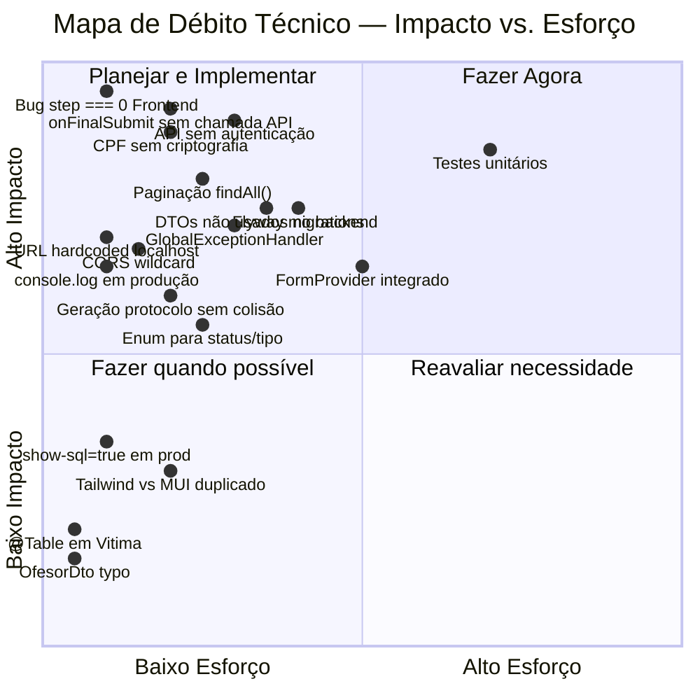
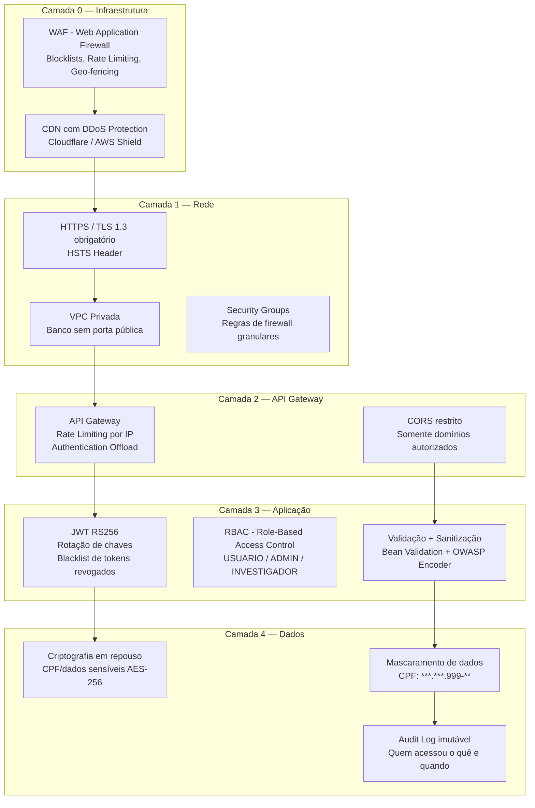
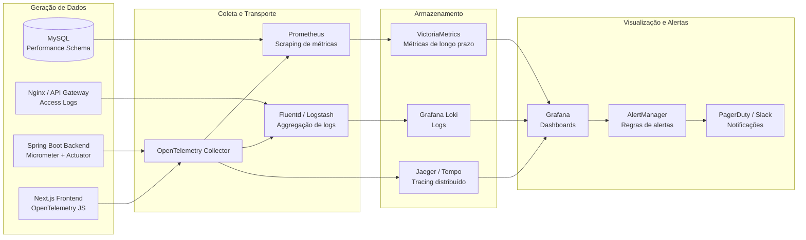
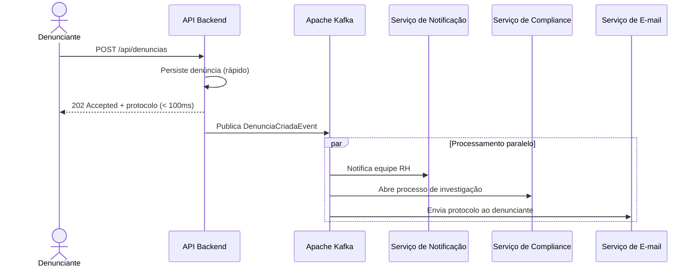
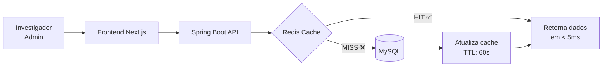
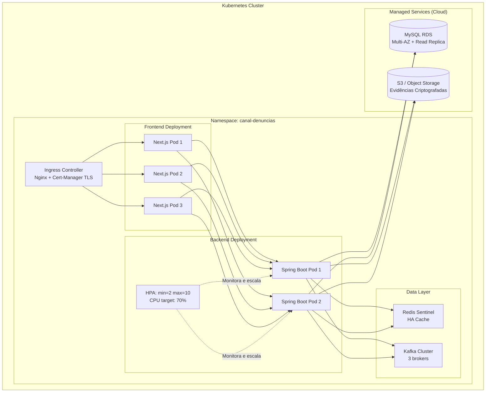
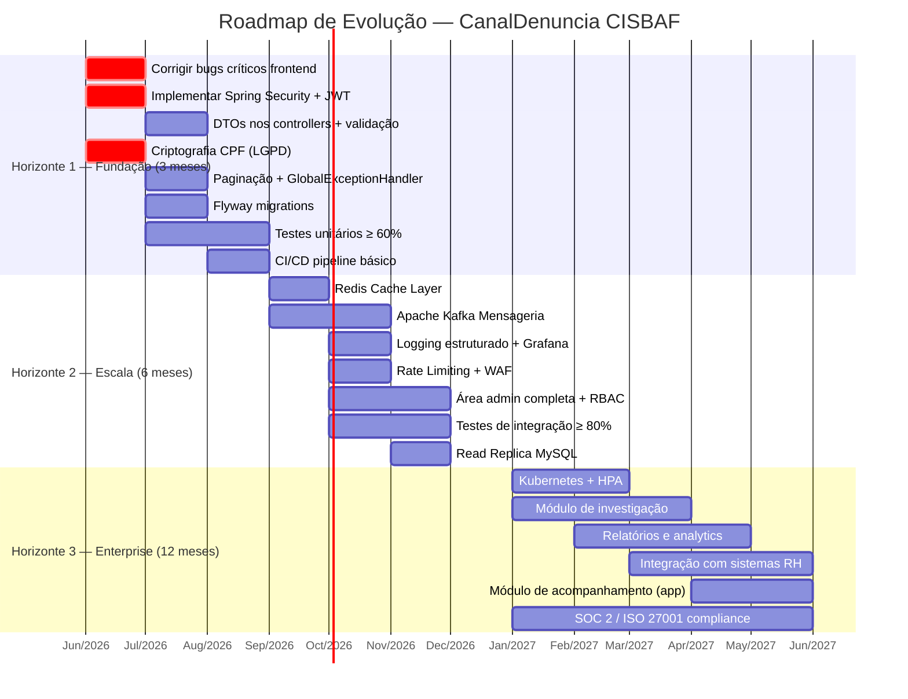

# 🧭 Plano Estratégico de Evolução — CanalDenuncia CISBAF
**Papel:** Tech Lead / Arquiteto de Soluções  
**Escopo:** Evolução de MVP para sistema Enterprise-grade  
**Base:** Análises técnicas de Backend (Java/Spring Boot) e Frontend (Next.js/React)

---

## Contexto: Onde estamos hoje

O sistema atual é um **MVP funcional com falhas críticas não resolvidas** e zero infraestrutura de produção. Antes de qualquer discussão sobre escala, é fundamental reconhecer que **o produto não está pronto para uso real** pelos motivos identificados nas análises:

- Frontend com wizard multi-step quebrado (bug `step === 0`)
- Dados do formulário nunca chegam ao backend
- API sem autenticação ou autorização
- CPF de vítimas em texto claro (LGPD)
- Area administrativa aberta publicamente

Este plano assume que os **bugs críticos serão corrigidos primeiro** e então apresenta o caminho de maturidade em 3 horizontes de tempo.

---

## 1. 📈 Escalabilidade — O que vai falhar primeiro

### Análise de Capacidade: 1.000 → 100.000 usuários simultâneos

#### Gargalo #1 — Single-instance sem estado compartilhado (CRÍTICO)

**O problema:**
```
Usuário A → [Container Backend A] → MySQL
Usuário B → [Container Backend B] → MySQL
```

O backend é uma aplicação Spring Boot **stateless por design**, mas o MySQL é o **único ponto de falha**. Ao escalar horizontalmente (múltiplas instâncias do backend), todas apontam para o mesmo banco sem connection pooling configurado adequadamente.

**Cenário de ruptura estimado:** ~500 conexões simultâneas — o MySQL padrão tem limite de 151 conexões.

**Mitigação imediata:**
```properties
# application.properties — Configurar HikariCP (já incluso no Spring Boot)
spring.datasource.hikari.maximum-pool-size=20
spring.datasource.hikari.minimum-idle=5
spring.datasource.hikari.connection-timeout=20000
spring.datasource.hikari.idle-timeout=300000
spring.datasource.hikari.max-lifetime=1200000
```

**Mitigação de médio prazo:**
- Separar **réplica de leitura** (MySQL Read Replica) para queries de listagem
- `findAll()` sem paginação vai derrubar a réplica de leitura também — corrigir antes

---

#### Gargalo #2 — `findAll()` sem paginação (CRÍTICO)

**O problema:**
```java
// DenunciaService.java — carrega a tabela INTEIRA em memória
public List<Denuncia> getAllDenuncias() {
    return denunciaRepository.findAll(); // Com 100k registros: OOM
}
```

Com 100.000 denúncias, cada objeto `Denuncia` carrega 4 entidades via `@OneToOne`. Uma única chamada a `GET /api/denuncias` pode instanciar ~500.000 objetos Java em memória, derrubando o heap da JVM.

**Mitigação (backend):**
```java
// Paginação obrigatória — implementar em todas as listagens
public Page<DenunciaDto> getAllDenuncias(Pageable pageable) {
    return denunciaRepository.findAll(pageable)
                             .map(denunciaMapper::toDto);
}

// Controller
@GetMapping
public ResponseEntity<Page<DenunciaDto>> getAllDenuncias(
    @PageableDefault(size = 20, sort = "dataRegistro", 
                     direction = Sort.Direction.DESC) Pageable pageable) {
    return ResponseEntity.ok(denunciaService.getAllDenuncias(pageable));
}
```

---

#### Gargalo #3 — N+1 Problem com `@OneToOne` e `CascadeType.ALL`

**O problema:**
```java
// Denuncia.java — 4 relacionamentos sem LAZY loading
@OneToOne(cascade = CascadeType.ALL, optional = true)
private Vitima vitima;      // SELECT extra

@OneToOne(cascade = CascadeType.ALL, optional = false)
private Ofensor ofensor;    // SELECT extra

@OneToOne(cascade = CascadeType.ALL, optional = false)
private Relato relato;      // SELECT extra

@OneToOne(cascade = CascadeType.ALL, optional = true)
private Terceiro terceiro;  // SELECT extra
```

Para uma página de 20 denúncias, o Hibernate executa **1 + (20 × 4) = 81 queries**. Com 100 denúncias na página: 401 queries.

**Mitigação:**
```java
// Usar projeções com JOIN FETCH em queries específicas
@Query("SELECT d FROM Denuncia d " +
       "LEFT JOIN FETCH d.ofensor " +
       "LEFT JOIN FETCH d.relato " +
       "LEFT JOIN FETCH d.vitima " +
       "LEFT JOIN FETCH d.terceiro " +
       "WHERE d.status = :status")
List<Denuncia> findByStatusWithRelations(@Param("status") String status);
```

---

#### Gargalo #4 — `ddl-auto=update` em produção

**O problema:** A cada restart da aplicação, o Hibernate verifica e potencialmente altera o schema do banco. Em um ambiente com múltiplas instâncias subindo simultaneamente, isso cria **condições de corrida** no schema.

**Mitigação imediata:**
```properties
# application-prod.properties
spring.jpa.hibernate.ddl-auto=validate  # Valida mas não altera
# Migrar para Flyway para controle total
```

---

#### Gargalo #5 — Ausência de cache para dados frequentes

**O problema:** Cada requisição ao painel admin busca dados do banco sem qualquer cache. Dados como listas de categorias, status possíveis e configurações são imutáveis mas consultados a cada render.

**Mitigação com Spring Cache:**
```java
@Service
public class DenunciaService {
    
    @Cacheable(value = "denuncias", key = "#pageable")
    public Page<DenunciaDto> getAllDenuncias(Pageable pageable) { ... }
    
    @CacheEvict(value = "denuncias", allEntries = true)
    public Denuncia criarDenuncia(DenunciaRequestDto dto) { ... }
}
```

---

### Mapa de Capacidade por Volume

| Volume | Gargalo Provável | Ação Necessária |
|---|---|---|
| **Até 500 usuários/dia** | Nenhum significativo | Corrigir bugs críticos |
| **1.000–5.000 usuários/dia** | `findAll()` sem paginação | Paginação + connection pool |
| **5.000–20.000 usuários/dia** | N+1 queries, MySQL sobrecarregado | Redis cache + read replica |
| **20.000–100.000 usuários/dia** | Single instance, sem load balancing | Kubernetes + HPA + CDN |
| **>100.000 usuários/dia** | Monolito Spring Boot como gargalo | Microsserviços + event sourcing |

---

## 2. 🏗️ Débito Técnico — O que refatorar antes de novas features

> [!WARNING]
> Débito técnico não tratado tem juros compostos. Cada nova feature construída sobre uma base frágil multiplica o custo de manutenção. Este mapa deve ser tratado como **pré-requisito para qualquer nova funcionalidade**.

### Mapa Completo de Débito Técnico



### Backlog de Débito Técnico Priorizado

#### Sprint 0 — Bugs Bloqueantes (3–5 dias)

| Item | Arquivo | Impacto |
|---|---|---|
| Corrigir condições `step === 0` | `FormularioFluxo.tsx` | Formulário completamente quebrado |
| Implementar `onFinalSubmit` com POST real | `FormularioFluxo.tsx` | Nenhum dado chega ao backend |
| Integrar steps ao `FormProvider` ou consolidar useForm | Todos os Steps | Dados descartados entre steps |
| Remover todos os `console.log` | Todos os componentes | CPF e dados pessoais no DevTools |

#### Sprint 1 — Segurança Base (1–2 semanas)

| Item | Arquivo | Débito |
|---|---|---|
| Implementar Spring Security + JWT | Novo `SecurityConfig.java` | API 100% aberta |
| Proteger rota `/admin` com middleware | `app/admin/layout.tsx` | Área admin pública |
| Substituir entidades por DTOs nos controllers | Todos os controllers | Mass assignment attack |
| Criptografar CPF no banco (AES-256) | `Vitima.java`, `Terceiro.java` | LGPD violada |
| Restringir CORS para domínios específicos | Nova `CorsConfig.java` | CORS wildcard |

#### Sprint 2 — Qualidade de Código (2–3 semanas)

| Item | Débito | Solução |
|---|---|---|
| Adicionar `@Valid` em todos os controllers | Validação sem efeito | Anotar DTOs com Bean Validation |
| Criar `@ControllerAdvice` global | Stack traces expostos | `GlobalExceptionHandler.java` |
| Converter `status`/`tipoDenunciante` para `enum` | Dados inconsistentes | `DenunciaStatus.java`, `TipoDenunciante.java` |
| Adicionar Flyway para migrações | `ddl-auto=update` em prod | Scripts SQL versionados |
| Criar `useSnackbar()` reutilizável no frontend | Código triplicado | Hook compartilhado |
| Corrigir URL hardcoded no admin | `localhost:8080` em prod | `NEXT_PUBLIC_API_URL` no `.env` |
| Corrigir `Optional<List<>>` no repository | Anti-pattern | Retornar `List<>` diretamente |

#### Sprint 3 — Maturidade e Testes (3–4 semanas)

| Item | Débito | Solução |
|---|---|---|
| Cobertura de testes unitários ≥ 80% | Pasta test/ vazia | JUnit 5 + Mockito + Testcontainers |
| Testes de integração dos endpoints | Sem validação contratual | Spring Boot Test + MockMvc |
| Adicionar paginação em todos os `findAll()` | OOM em produção | `Pageable` em todos os services |
| Substituir `@Data` por `@Getter @Setter` nas entidades | Risco de loop infinito | Refatorar todos os models |
| Decompor StepA e StepD (700+ linhas) | God Components | Extrair subcomponentes |
| Remover Tailwind (não utilizado) | Bundle inchado | Padronizar no MUI |

---

## 3. 🔒 Segurança Avançada — Camadas de Proteção para Produção

### Arquitetura de Segurança em Camadas (Defense in Depth)



---

### Implementações de Segurança Detalhadas

#### 3.1 — Autenticação e Autorização (Spring Security + JWT)

```java
// SecurityConfig.java
@Configuration
@EnableWebSecurity
@EnableMethodSecurity
public class SecurityConfig {

    @Bean
    public SecurityFilterChain filterChain(HttpSecurity http) throws Exception {
        return http
            .csrf(AbstractHttpConfigurer::disable)
            .sessionManagement(s -> s.sessionCreationPolicy(STATELESS))
            .authorizeHttpRequests(auth -> auth
                // Rotas públicas — somente criação de denúncia
                .requestMatchers(POST, "/api/denuncias").permitAll()
                // Rotas administrativas — requerem role ADMIN
                .requestMatchers("/api/admin/**").hasRole("ADMIN")
                .requestMatchers(GET, "/api/denuncias/**").hasAnyRole("ADMIN", "INVESTIGADOR")
                // Tudo mais — autenticado
                .anyRequest().authenticated()
            )
            .addFilterBefore(jwtFilter, UsernamePasswordAuthenticationFilter.class)
            .build();
    }
}
```

#### 3.2 — Criptografia de Dados Sensíveis (LGPD)

```java
// CpfEncryptionConverter.java — JPA AttributeConverter
@Converter
public class CpfEncryptionConverter implements AttributeConverter<String, String> {
    
    private final AesEncryptionService aesService;
    
    @Override
    public String convertToDatabaseColumn(String cpf) {
        return cpf != null ? aesService.encrypt(cpf) : null;
    }
    
    @Override
    public String convertToEntityAttribute(String encryptedCpf) {
        return encryptedCpf != null ? aesService.decrypt(encryptedCpf) : null;
    }
}

// Vitima.java — uso do converter transparente
@Convert(converter = CpfEncryptionConverter.class)
@Column(name = "cpf")
private String cpf;
```

#### 3.3 — Audit Log com Spring Data Envers

```java
// Denuncia.java
@Entity
@Audited  // Histórico de todas as mudanças
@Table(name = "denuncias")
public class Denuncia {
    
    @CreatedBy
    @Column(name = "criado_por", updatable = false)
    private String criadoPor;
    
    @LastModifiedBy
    @Column(name = "modificado_por")
    private String modificadoPor;
    
    @CreationTimestamp
    @Column(name = "criado_em", updatable = false)
    private LocalDateTime criadoEm;
    
    @UpdateTimestamp
    @Column(name = "modificado_em")
    private LocalDateTime modificadoEm;
}
```

#### 3.4 — Rate Limiting por Endpoint

```java
// RateLimitFilter.java — Bucket4j + Redis
@Component
public class RateLimitFilter extends OncePerRequestFilter {
    
    // Limite de 5 denúncias por IP por hora
    private final RateLimiter denunciaLimiter = RateLimiter.create(5.0 / 3600);
    
    @Override
    protected void doFilterInternal(HttpServletRequest request, ...) {
        if (request.getRequestURI().startsWith("/api/denuncias") 
            && request.getMethod().equals("POST")) {
            
            String clientIp = getClientIp(request);
            Bucket bucket = getOrCreateBucket(clientIp);
            
            if (!bucket.tryConsume(1)) {
                response.setStatus(429); // Too Many Requests
                return;
            }
        }
        filterChain.doFilter(request, response);
    }
}
```

#### 3.5 — Headers de Segurança HTTP (Next.js)

```typescript
// next.config.ts
const securityHeaders = [
  { key: 'X-DNS-Prefetch-Control', value: 'on' },
  { key: 'Strict-Transport-Security', value: 'max-age=63072000; includeSubDomains; preload' },
  { key: 'X-Frame-Options', value: 'SAMEORIGIN' },
  { key: 'X-Content-Type-Options', value: 'nosniff' },
  { key: 'Referrer-Policy', value: 'origin-when-cross-origin' },
  { key: 'Content-Security-Policy', value: [
    "default-src 'self'",
    "script-src 'self' 'unsafe-eval' 'unsafe-inline'",
    "style-src 'self' 'unsafe-inline'",
    "img-src 'self' data: blob:",
    "font-src 'self'",
    "connect-src 'self' https://api.cisbaf.gov.br",
  ].join('; ')},
  { key: 'Permissions-Policy', value: 'camera=(), microphone=(), geolocation=()' },
];
```

#### 3.6 — Checklist de Segurança para Produção

| Item | Prioridade | Status Atual |
|---|---|---|
| HTTPS/TLS 1.3 obrigatório | 🔴 Crítica | ❌ Sem HTTPS configurado |
| JWT com RS256 (chaves assimétricas) | 🔴 Crítica | ❌ Sem autenticação |
| RBAC (Admin / Investigador / Público) | 🔴 Crítica | ❌ Sem autorização |
| CPF criptografado em repouso (AES-256) | 🔴 Crítica | ❌ Texto claro |
| Rate limiting por IP | 🟡 Alta | ❌ Sem limite |
| CORS restrito | 🟡 Alta | ❌ Wildcard `*` |
| Headers de segurança HTTP | 🟡 Alta | ❌ Ausentes |
| Audit log de acessos | 🟡 Alta | ❌ Ausente |
| Penetration testing | 🟢 Média | ❌ Nunca realizado |
| DAST / SAST no pipeline | 🟢 Média | ❌ Sem CI/CD |
| Gestão de secrets (Vault / AWS SSM) | 🟢 Média | ⚠️ `.env` no Docker |
| Varredura de dependências (Dependabot) | 🟢 Média | ❌ Ausente |

---

## 4. 📊 Monitoramento e Observabilidade

> [!NOTE]
> Monitorar um sistema de denúncias vai além de métricas técnicas. É necessário monitorar **indicadores de uso suspeito** (múltiplas denúncias do mesmo IP, tentativas de acesso à area admin, etc.) para garantir a integridade dos dados e a segurança das vítimas.

### Stack de Observabilidade Recomendada



---

### 4.1 — Métricas de Negócio (o que realmente importa)

```java
// DenunciaMetrics.java — Spring Boot + Micrometer
@Component
public class DenunciaMetrics {
    
    private final MeterRegistry registry;
    
    // Contador de denúncias por categoria
    public void registrarDenuncia(String categoria, boolean anonima) {
        registry.counter("denuncias.criadas.total",
            "categoria", categoria,
            "anonima", String.valueOf(anonima)
        ).increment();
    }
    
    // Tempo médio de resolução de denúncias
    public void registrarResolucao(long diasAteResolucao, String status) {
        registry.summary("denuncias.tempo_resolucao.dias",
            "status", status
        ).record(diasAteResolucao);
    }
    
    // Gauge de denúncias pendentes
    public void atualizarDenunciasPendentes(long count) {
        Gauge.builder("denuncias.pendentes.total", () -> count)
             .register(registry);
    }
}
```

---

### 4.2 — Métricas Técnicas Essenciais

| Categoria | Métrica | SLO Sugerido | Alerta |
|---|---|---|---|
| **Disponibilidade** | Uptime da API | ≥ 99.9% | < 99.5% em 5 min |
| **Latência** | P95 de resposta POST /denuncias | < 500ms | > 1s |
| **Latência** | P99 de resposta GET /admin | < 2s | > 5s |
| **Erros** | Taxa de erros 5xx | < 0.1% | > 1% em 1 min |
| **Banco** | Connection pool utilization | < 70% | > 85% |
| **Banco** | Slow queries (> 500ms) | 0 | Qualquer ocorrência |
| **JVM** | Heap usage | < 75% | > 90% por 5 min |
| **JVM** | GC pause time | < 100ms | > 500ms |
| **Frontend** | Core Web Vitals LCP | < 2.5s | > 4s |
| **Frontend** | Erros JS não capturados | 0 | Qualquer novo erro |
| **Segurança** | Tentativas de acesso /admin não autenticadas | < 5/min | > 20/min |
| **Segurança** | Requests bloqueados por rate limit | < 10/min | > 100/min |

---

### 4.3 — Logging Estruturado (JSON)

```java
// LoggingConfig.java — Logback com estrutura JSON
// application.properties
logging.structured.format.console=logstash
logging.include-application-name=true

// Exemplo de log estruturado gerado:
{
  "@timestamp": "2026-06-01T18:30:00.000Z",
  "level": "INFO",
  "service": "canal-denuncias-backend",
  "trace_id": "abc123def456",
  "span_id": "789xyz",
  "event": "denuncia.criada",
  "protocolo": "PROT-20260601183000",
  "categoria": "Assedio_Moral",
  "anonima": true,
  "ip_origem": "203.0.113.0",    // Nunca logar dados pessoais
  "duracao_ms": 245
}
```

**Regras de logging para sistema de denúncias:**
- ❌ Nunca logar: CPF, nome completo, email, telefone, conteúdo do relato
- ✅ Sempre logar: protocolo, categoria, status, duração, IP de origem (mascarado)
- ✅ Logar tentativas de acesso negadas com contexto completo

---

### 4.4 — Distributed Tracing

```java
// Rastrear o ciclo completo de uma denúncia
// Com OpenTelemetry + Micrometer Tracing (incluso no Spring Boot 3+)

@Service
public class DenunciaService {
    
    @NewSpan("denuncia.criar")
    public Denuncia criarDenuncia(@SpanTag("categoria") String categoria,
                                   DenunciaRequestDto dto) {
        // Span automático com atributos de negócio
        return denunciaRepository.save(mapper.toEntity(dto));
    }
}
```

---

### 4.5 — Health Checks e SLOs

```yaml
# application.properties — Spring Boot Actuator
management.endpoints.web.exposure.include=health,metrics,prometheus,info
management.endpoint.health.show-details=when-authorized
management.health.db.enabled=true

# Verificações de saúde customizadas
management.endpoint.health.group.readiness.include=db,diskSpace
management.endpoint.health.group.liveness.include=ping
```

---

## 5. 🚀 Roadmap Arquitetural — Evolução para Enterprise

### Implementação 1 — Mensageria Assíncrona com Apache Kafka

**Motivação:** O ciclo atual de uma denúncia é **síncrono e bloqueante**. Em uma organização grande, criar uma denúncia deve disparar múltiplos workflows em paralelo (notificação ao RH, ao Compliance, geração de protocolo, envio de e-mail de confirmação) sem que o usuário aguarde todos eles.



**Benefícios:**
- Resposta ao usuário em < 100ms (sem aguardar e-mail, etc.)
- Desacoplamento total entre domínios
- Tolerância a falhas: se o serviço de e-mail cair, a denúncia não é perdida
- Audit trail natural (Kafka retém eventos por 30 dias)

**Stack recomendada:**
```xml
<!-- pom.xml -->
<dependency>
    <groupId>org.springframework.kafka</groupId>
    <artifactId>spring-kafka</artifactId>
</dependency>
```

```java
// DenunciaEvent.java
public record DenunciaCriadaEvent(
    String protocolo,
    String categoria,
    boolean anonima,
    LocalDateTime criadaEm
) {} // Sem dados pessoais no evento

// DenunciaService.java
@Transactional
public Denuncia criarDenuncia(DenunciaRequestDto dto) {
    Denuncia salva = denunciaRepository.save(mapper.toEntity(dto));
    kafkaTemplate.send("denuncias.criadas", 
                       new DenunciaCriadaEvent(salva.getProtocolo(), ...));
    return salva;
}
```

---

### Implementação 2 — Cache em Memória com Redis

**Motivação:** O painel administrativo (futuro) fará consultas frequentes às mesmas listas de denúncias por status, por investigador, e por período. Sem cache, cada clique na dashboard resulta em queries pesadas ao MySQL.



**Padrões de cache para o domínio:**

| Dado | TTL | Estratégia | Invalidação |
|---|---|---|---|
| Lista de denúncias por status | 60s | Cache-Aside | Ao criar/atualizar denúncia |
| Denúncia por protocolo | 5min | Cache-Aside | Ao atualizar status |
| Métricas de dashboard | 30s | Read-Through | Automática por TTL |
| Dados do ofensor por ID | 10min | Cache-Aside | Ao atualizar ofensor |
| Configurações do sistema | 1h | Cache-Aside | Manual por admin |

```java
// application.properties — Redis como cache L2
spring.cache.type=redis
spring.data.redis.host=${REDIS_HOST:localhost}
spring.data.redis.port=${REDIS_PORT:6379}
spring.data.redis.password=${REDIS_PASSWORD}
spring.cache.redis.time-to-live=60000

// DenunciaService.java
@Cacheable(value = "denuncias-por-status", key = "#status + '-' + #pageable.pageNumber")
public Page<DenunciaDto> findByStatus(String status, Pageable pageable) { ... }

@CacheEvict(value = {"denuncias-por-status", "denuncias-dashboard"}, allEntries = true)
@Transactional
public Denuncia atualizarStatus(UUID id, String novoStatus) { ... }
```

**Impacto esperado:**
- Redução de ~80% na carga do MySQL para consultas de listagem
- Tempo de resposta do dashboard: de 800ms → < 50ms
- Suporte a 10x mais usuários simultâneos com o mesmo hardware

---

### Implementação 3 — Orquestração com Kubernetes + Autoscaling

**Motivação:** O sistema atual roda em containers Docker simples, mas sem orquestração. Se o container do backend cair, o sistema fica fora do ar. Se houver pico de denúncias (ex: evento corporativo), não há como escalar automaticamente.



**Manifests Kubernetes essenciais:**

```yaml
# backend-hpa.yaml — Autoscaling baseado em CPU e métricas customizadas
apiVersion: autoscaling/v2
kind: HorizontalPodAutoscaler
metadata:
  name: canal-denuncias-backend
spec:
  scaleTargetRef:
    apiVersion: apps/v1
    kind: Deployment
    name: canal-denuncias-backend
  minReplicas: 2
  maxReplicas: 10
  metrics:
  - type: Resource
    resource:
      name: cpu
      target:
        type: Utilization
        averageUtilization: 70
  - type: Pods
    pods:
      metric:
        name: denuncias_criadas_por_segundo
      target:
        type: AverageValue
        averageValue: "100"
```

```yaml
# backend-pdb.yaml — Garantia de disponibilidade durante updates
apiVersion: policy/v1
kind: PodDisruptionBudget
metadata:
  name: canal-denuncias-backend-pdb
spec:
  minAvailable: 1
  selector:
    matchLabels:
      app: canal-denuncias-backend
```

**Benefícios imediatos:**
- **Zero downtime deployments** com rolling updates
- **Auto-recuperação**: pods que crasham são reiniciados automaticamente
- **Autoscaling**: picos de uso gerenciados automaticamente
- **Isolamento**: falha em uma versão não afeta outra (blue-green deployment)
- **GitOps**: infra como código, auditável e versionado

---

## Cronograma de Maturidade — Os 3 Horizontes



---

## Scorecard de Maturidade Atual vs. Meta

| Dimensão | Hoje | Meta H1 | Meta H2 | Meta H3 |
|---|:---:|:---:|:---:|:---:|
| **Funcionalidade** | 2/10 | 7/10 | 8/10 | 10/10 |
| **Segurança** | 1/10 | 6/10 | 8/10 | 10/10 |
| **Performance** | 3/10 | 5/10 | 8/10 | 9/10 |
| **Observabilidade** | 0/10 | 4/10 | 8/10 | 10/10 |
| **Escalabilidade** | 1/10 | 4/10 | 7/10 | 9/10 |
| **Manutenibilidade** | 3/10 | 6/10 | 8/10 | 9/10 |
| **Conformidade LGPD** | 1/10 | 7/10 | 9/10 | 10/10 |
| **Cobertura de Testes** | 0/10 | 5/10 | 8/10 | 9/10 |

> [!IMPORTANT]
> **A mensagem mais importante deste documento:** Antes de qualquer evolução arquitetural ou nova feature, o sistema precisa funcionar. Os 5 bugs críticos identificados (wizard quebrado, dados não enviados, API sem auth, CPF sem criptografia, admin exposto) não são dívidas técnicas — são falhas de produto que impedem o uso real. O Horizonte 1 é o pré-requisito absoluto para tudo que vem depois.
